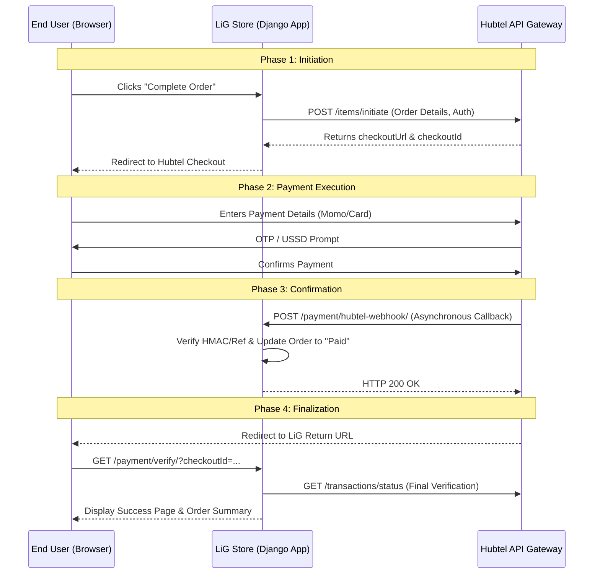

# Hubtel API Integration Flow - LiG Store

This document outlines the end-to-end integration flow between the **LiG Store** application and **Hubtel's Payment APIs**. This flow is designed to ensure secure, reliable, and user-friendly transaction processing.

---

## 1. High-Level Architecture
The integration uses a **Server-Side Redirect** model combined with **Asynchronous Webhooks** (Callbacks) for maximum reliability.

---

## 2. Detailed Step-by-Step Process

### Step 1: Transaction Initiation
When a user confirms their order, LiG generates a unique `clientReference` (e.g., `PAY_123456`) and sends a server-to-server request to Hubtel’s `initiate` endpoint.
- **Endpoint:** `https://payproxyapi.hubtel.com/items/initiate`
- **Data Sent:** Amount, Customer Info, Reference, and Callback/Return URLs.
- **Result:** LiG receives a `checkoutUrl` and redirects the user’s browser there.

### Step 2: User Payment (Off-site)
The user completes the payment on Hubtel’s secure hosted checkout page. This supports:
- Mobile Money (MTN, Telecel, AT)
- Visa / Mastercard

### Step 3: Server-to-Server Callback (Webhook)
Immediately after the transaction is processed, Hubtel sends a `POST` request to our callback URL.
- **Endpoint:** `https://lig-store.com/payment/hubtel-webhook/`
- **Purpose:** This ensures the order is marked as **Paid** even if the user closes their browser before being redirected back.

### Step 4: Browser Redirect & Verification
The user is redirected back to the LiG website.
- **Endpoint:** `https://lig-store.com/payment/verify/`
- **Action:** LiG performs a final status check via the Hubtel Status API to ensure integrity before showing the success message.

---

## 3. Data Integrity & Security
- **Unique References:** Every transaction uses a unique `clientReference` to prevent double-spending.
- **Status Checks:** We do not rely solely on the browser redirect; we use the **Merchant Status API** for source-of-truth verification.
- **Logging:** All API interactions are logged in `payments.log` for audit trails.

---

## 4. API Endpoints Used
| Action | Method | Hubtel Endpoint |
| :--- | :--- | :--- |
| **Initiate** | `POST` | `https://payproxyapi.hubtel.com/items/initiate` |
| **Status Check** | `GET` | `https://rmsc.hubtel.com/v1/merchantaccount/merchants/{ID}/transactions/status` |
| **Webhook** | `POST` | `https://your-domain.com/payment/hubtel-webhook/` (Our Endpoint) |

---
**Prepared for:** Hubtel UAT Requirements  
**Application:** LiG Store  
**Date:** May 2026
